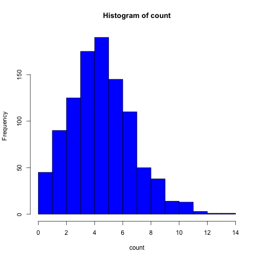
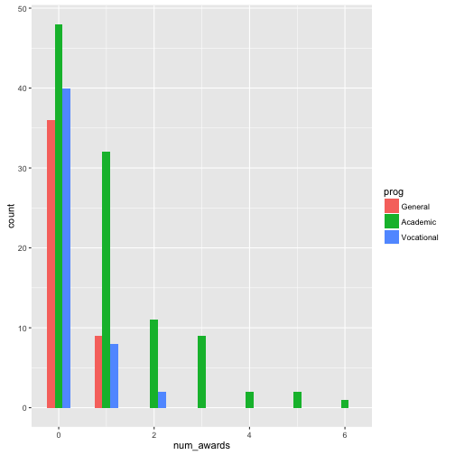
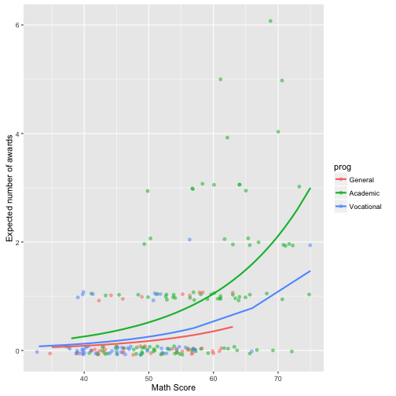
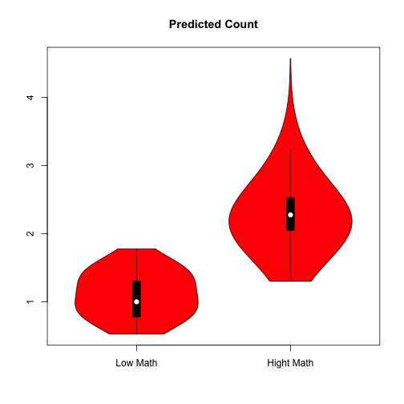
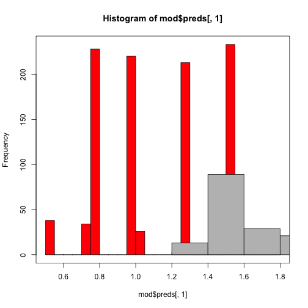

## The Observed Value Approach for MNL

> - Fit the Model to the Data
> - Obtain the coefficients and variance covariance matrix.
> - Simulate coefficients from multivariate normal distribution.
> - Use observed values to calculate the probability of being in eaching 
category.
--- .class #id 

---

```
## Loading required package: foreign
```

```
## Loading required package: mlogit
```

```
## Loading required package: Formula
```

```
## Loading required package: maxLik
```

```
## Loading required package: miscTools
```

```
## 
## Please cite the 'maxLik' package as:
## Henningsen, Arne and Toomet, Ott (2011). maxLik: A package for maximum likelihood estimation in R. Computational Statistics 26(3), 443-458. DOI 10.1007/s00180-010-0217-1.
## 
## If you have questions, suggestions, or comments regarding the 'maxLik' package, please use a forum or 'tracker' at maxLik's R-Forge site:
## https://r-forge.r-project.org/projects/maxlik/
```
--- 


---
Estimated Coefficients

```r
test
```

```
## 
## Call:
## mlogit(formula = prog ~ 1 | ses + write, data = ml_1, reflevel = "academic",     probit = FALSE, method = "nr", print.level = 0)
## 
## Coefficients:
##  general:(intercept)  vocation:(intercept)     general:sesmiddle  
##             2.852186              5.218200             -0.533291  
##   vocation:sesmiddle       general:seshigh      vocation:seshigh  
##             0.291393             -1.162832             -0.982670  
##        general:write        vocation:write  
##            -0.057928             -0.113603
```
---


---
What can we extract from the text object?


```r
coef(test)
```

```
##  general:(intercept) vocation:(intercept)    general:sesmiddle 
##           2.85218622           5.21820011          -0.53329101 
##   vocation:sesmiddle      general:seshigh     vocation:seshigh 
##           0.29139311          -1.16283199          -0.98267029 
##        general:write       vocation:write 
##          -0.05792841          -0.11360264 
## attr(,"fixed")
##  general:(intercept) vocation:(intercept)    general:sesmiddle 
##                FALSE                FALSE                FALSE 
##   vocation:sesmiddle      general:seshigh     vocation:seshigh 
##                FALSE                FALSE                FALSE 
##        general:write       vocation:write 
##                FALSE                FALSE
```
---

---
What can we extract from the text object?


```r
vcov(test)
```

```
##                      general:(intercept) vocation:(intercept)
## general:(intercept)           1.36058026           0.66778357
## vocation:(intercept)          0.66778357           1.35384619
## general:sesmiddle            -0.09395500          -0.04451320
## vocation:sesmiddle           -0.06677804          -0.10785805
## general:seshigh              -0.05981289          -0.03807395
## vocation:seshigh             -0.06772187          -0.12863979
## general:write                -0.02383235          -0.01124761
## vocation:write               -0.01099920          -0.02425350
##                      general:sesmiddle vocation:sesmiddle general:seshigh
## general:(intercept)      -0.0939550025      -6.677804e-02   -0.0598128920
## vocation:(intercept)     -0.0445132041      -1.078580e-01   -0.0380739460
## general:sesmiddle         0.1968982082       9.180481e-02    0.1225343339
## vocation:sesmiddle        0.0918048114       2.269319e-01    0.0636261299
## general:seshigh           0.1225343339       6.362613e-02    0.2644216472
## vocation:seshigh          0.0641289336       1.601999e-01    0.0993138541
## general:write            -0.0005216298       7.442614e-05   -0.0011822676
## vocation:write           -0.0003719121      -1.062758e-03   -0.0004612158
##                      vocation:seshigh general:write vocation:write
## general:(intercept)     -6.772187e-02 -2.383235e-02  -0.0109992033
## vocation:(intercept)    -1.286398e-01 -1.124761e-02  -0.0242534988
## general:sesmiddle        6.412893e-02 -5.216298e-04  -0.0003719121
## vocation:sesmiddle       1.601999e-01  7.442614e-05  -0.0010627581
## general:seshigh          9.931385e-02 -1.182268e-03  -0.0004612158
## vocation:seshigh         3.547000e-01  8.439272e-05  -0.0006283594
## general:write            8.439272e-05  4.584286e-04   0.0002039003
## vocation:write          -6.283594e-04  2.039003e-04   0.0004937239
```
---

---
So Let's do the simulations:


```r
#observed values for multinomial
library(MASS)
library(mvtnorm)
n.draws <- 50
set.seed(123)
sim.coefs <- rmvnorm(n.draws, coef(test), vcov(test)) 
head(sim.coefs)
```

```
##      general:(intercept) vocation:(intercept) general:sesmiddle
## [1,]            2.018905             4.679916        0.22694697
## [2,]            1.860435             4.433063        0.09967418
## [3,]            2.865965             3.225307       -0.43291413
## [4,]            1.596803             3.057821       -0.21782745
## [5,]            4.050451             6.424496       -0.12348334
## [6,]            2.023477             4.742814       -0.69810113
##      vocation:sesmiddle general:seshigh vocation:seshigh general:write
## [1,]          0.7600901      -0.7393952       0.09943457   -0.05059648
## [2,]          0.6310082      -0.7624847      -0.74454846   -0.04798940
## [3,]          0.1768749      -1.6194320      -1.11603634   -0.06157040
## [4,]          0.6889271      -1.4652665      -0.18553688   -0.03585208
## [5,]          0.6108127      -0.8002564      -0.91613649   -0.08593814
## [6,]          1.0354473      -0.7117518      -1.21330788   -0.04504081
##      vocation:write
## [1,]    -0.11687325
## [2,]    -0.09712980
## [3,]    -0.07585559
## [4,]    -0.08011949
## [5,]    -0.14145209
## [6,]    -0.11515655
```
---


---
Use the coefficients to caculated probability of being in General or 
Vocational tracks.

```r
  # second, for current set of coefs, loop through each observation
  # and values for the linear predictors
  for(j in 1:n.obs){
    
    ###reordered columns are now numbered consitently here ###
    Xb.gen[j] <- sim.coefs[i,1] + sim.coefs[i,3] + sim.coefs[i,5]
    Xb.voc[j] <- sim.coefs[i,2] + sim.coefs[i,4] + sim.coefs[i,6]
  }
  ####calculate probability of being in category voc or gen for each observation####
  p.gen=exp(Xb.gen)/(1+exp(Xb.gen)+exp(Xb.voc))
  p.voc=exp(Xb.voc)/(1+exp(Xb.gen)+exp(Xb.voc))
  ####average probability across all observations####
  p.gen[i]<-mean(p.gen)
  p.voc[i]<-mean(p.voc)
}
```
---


---

```r
test <- mlogit(prog ~ 1 | ses + write,  data = ml_1, 
               reflevel="academic", probit=FALSE)
test1 <- mlogit(prog ~ 1 | ses + write,  data = ml_1, 
               reflevel="academic", probit=FALSE,alt.subset=c("general","academic"))
hmftest(test,test1)
```

```
## 
## 	Hausman-McFadden test
## 
## data:  ml_1
## chisq = 0.5438, df = 4, p-value = 0.9691
## alternative hypothesis: IIA is rejected
```
---


---
## Models for Counting: Poisson 

```r
count<-rpois(1000,5)
hist(count,col="blue")
```


---

---
## The Poisson Regression Model
> - $E(y)=\mu$
> - $Var(y)=E(y)=\mu$
> - $Pr(y|\mu)=\frac{exp(-\mu)\mu^y}{y!}$
> - $\mu_i=E(y_i|x_i)=exp(\mathbf{x_i\beta})$


---
## R Example:


```r
p <- read.csv("http://www.ats.ucla.edu/stat/data/poisson_sim.csv")
p <- within(p, {
  prog <- factor(prog, levels=1:3, labels=c("General", "Academic", "Vocational"))
  id <- factor(id)
})
summary(p)
```

```
##        id        num_awards           prog          math      
##  1      :  1   Min.   :0.00   General   : 45   Min.   :33.00  
##  2      :  1   1st Qu.:0.00   Academic  :105   1st Qu.:45.00  
##  3      :  1   Median :0.00   Vocational: 50   Median :52.00  
##  4      :  1   Mean   :0.63                    Mean   :52.65  
##  5      :  1   3rd Qu.:1.00                    3rd Qu.:59.00  
##  6      :  1   Max.   :6.00                    Max.   :75.00  
##  (Other):194
```
---


---
Describe the Count of Awards

```r
library(ggplot2)
ggplot(p, aes(num_awards, fill = prog)) + geom_histogram(binwidth=.5, position="dodge")
```


---

---

```r
summary(m1 <- glm(num_awards ~ prog + math, family="poisson", data=p))
```

```
## 
## Call:
## glm(formula = num_awards ~ prog + math, family = "poisson", data = p)
## 
## Deviance Residuals: 
##     Min       1Q   Median       3Q      Max  
## -2.2043  -0.8436  -0.5106   0.2558   2.6796  
## 
## Coefficients:
##                Estimate Std. Error z value Pr(>|z|)    
## (Intercept)    -5.24712    0.65845  -7.969 1.60e-15 ***
## progAcademic    1.08386    0.35825   3.025  0.00248 ** 
## progVocational  0.36981    0.44107   0.838  0.40179    
## math            0.07015    0.01060   6.619 3.63e-11 ***
## ---
## Signif. codes:  0 '***' 0.001 '**' 0.01 '*' 0.05 '.' 0.1 ' ' 1
## 
## (Dispersion parameter for poisson family taken to be 1)
## 
##     Null deviance: 287.67  on 199  degrees of freedom
## Residual deviance: 189.45  on 196  degrees of freedom
## AIC: 373.5
## 
## Number of Fisher Scoring iterations: 6
```
---


---

```r
## calculate and store predicted values
p$phat <- predict(m1, type="response")

## order by program and then by math
p <- p[with(p, order(prog, math)), ]
```
---

---

```r
## create the plot
ggplot(p, aes(x = math, y = phat, colour = prog)) +
  geom_point(aes(y = num_awards), alpha=.5, position=position_jitter(h=.2)) +
  geom_line(size = 1) + labs(x = "Math Score", y = "Expected number of awards")
```


---


---

Observed Value Approach for Counts

```r
library(obsval)

mod <- obsval(num_awards ~ prog + math, data=p,
              reg.model = "poisson",
              n.draws = 1000,
              effect.var = "math",
              effect.vals = c(65,75), # lowest to mid
              verbose = TRUE)
```

```
## Estimating model...
## Done estimating model.
## Drawing simulated coefficients from posterior distribution...
## Finished drawing simulated coefficients from posterior distribution...
## Now in obsvalPredict() ... 
## Constructing X.matrix ... Generating control predictions ... 
## Entered computePreds()... 
## Generating predictions for each set of simulated coefficients ...
## Calculated predictions for each set of simulated coefficients.
```
---


---

```r
library(vioplot)
```

```
## Loading required package: sm
```

```
## Package 'sm', version 2.2-5.4: type help(sm) for summary information
```

```
## 
## Attaching package: 'sm'
```

```
## The following object is masked from 'package:MASS':
## 
##     muscle
```
---


---

```r
vioplot(mod$sim.coef[,2], mod$sim.coef[,3], mod$sim.coef[,4], names=c("Academic","Vocational","Math"), 
        col="red")
title("Coefficients")
```


---

---

```r
#head(mod$preds)
vioplot(mod$preds[,1], mod$preds[,2], names=c("Low Math","Hight Math"), 
        col="red")
title("Predicted Count")
```


---


---

```r
hist(mod$preds[,1],breaks=20,col="red")
hist(mod$preds[,2], breaks=20,col="grey",add=T)
box()
```


---

---
Test of Over dispersion

```r
library(AER)
```

```
## Loading required package: car
```

```
## Loading required package: lmtest
```

```
## Loading required package: zoo
```

```
## 
## Attaching package: 'zoo'
```

```
## The following objects are masked from 'package:base':
## 
##     as.Date, as.Date.numeric
```

```
## Loading required package: sandwich
```

```
## Loading required package: survival
```
---


---
Cameron & Trivedi (1990).
Assume the mean is $E(Y)=\mu$ and the variance is $Var(Y)=\mu$. On may test this assumption as a null hypothesis against an alternative where $Var(Y)=\mu+c∗f(\mu)$ where the constant $c<0$ means under dispersion and $c>0$ means over dispersion. 

$H_0:c=0$ vs. $H_1:c\ne 0$ and the test statistic is asymptotically standard normal under the null.

```r
dispersiontest(m1,trafo=1)
```

```
## 
## 	Overdispersion test
## 
## data:  m1
## z = 0.53224, p-value = 0.2973
## alternative hypothesis: true alpha is greater than 0
## sample estimates:
##      alpha 
## 0.04725442
```
---


---

```r
summary(m2 <- glm.nb(num_awards ~ prog + math, data=p))
```

```
## 
## Call:
## glm.nb(formula = num_awards ~ prog + math, data = p, init.theta = 6.114661779, 
##     link = log)
## 
## Deviance Residuals: 
##     Min       1Q   Median       3Q      Max  
## -2.0322  -0.8343  -0.5039   0.2276   2.3222  
## 
## Coefficients:
##                Estimate Std. Error z value Pr(>|z|)    
## (Intercept)    -5.29331    0.70416  -7.517 5.60e-14 ***
## progAcademic    1.07507    0.36699   2.929   0.0034 ** 
## progVocational  0.36696    0.45230   0.811   0.4172    
## math            0.07107    0.01153   6.165 7.05e-10 ***
## ---
## Signif. codes:  0 '***' 0.001 '**' 0.01 '*' 0.05 '.' 0.1 ' ' 1
## 
## (Dispersion parameter for Negative Binomial(6.1147) family taken to be 1)
## 
##     Null deviance: 257.93  on 199  degrees of freedom
## Residual deviance: 169.76  on 196  degrees of freedom
## AIC: 373.81
## 
## Number of Fisher Scoring iterations: 1
## 
## 
##               Theta:  6.11 
##           Std. Err.:  5.58 
## 
##  2 x log-likelihood:  -363.811
```
---

---

```r
summary(m3 <- zeroinfl(num_awards ~ prog+math| math, data=p))
```
---


